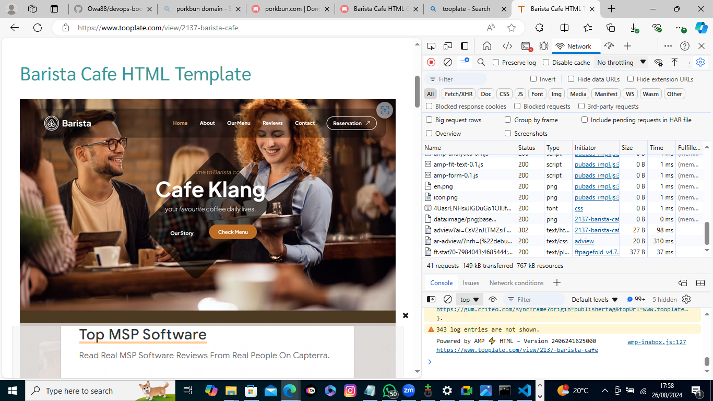

# Documentation
## Checklist

Task 1: Buy a domain name

Task 2: Spin up an Ubuntu server and assign an elastic IP to it

Task 3: SSH into the server and install Nginx

Task 4: Download freely HTML website files(Too plate) or use your personal code

Task 5: Copy the website file to the nginx website directory
 
Task 6: Validate the website using the server IP address

Task 7: In Route53,create an A record and add the elastic IP

Task 8: Using DNS verify the website setup

Task 9: Install certbot and request for an SSL/TLS Certificate

Validate the website SSL usinf the openSSL utility

## Documentation

### Setting up an ubuntu server
 - log into your AWS server as a ##root user
 -Search and click EC2 within the AWS management console and create and ubuntu server

Click on Launch instance

Name your instace and select the ubuntu AMI

Create new pair

Enter a Key pair name

Enable SSH,HTTP and HTTPS and proceed to click Launch instance
Click on View all instance

Click on Create instance

Click on Connect button

Copy the command under the SSH client

Open the terminal in the directory .pem file

Open the terminal in a specific folder

Create ,allign and allocate Elastic IP address

Associate the elastic IP address with your running instances

Install Nginx

Obtain a website template from Tooplate

Run this command **sudo curl -o/var/www/html/2137_barista_barista_cafe.zip** to download the websites file to your html directory

The curl command is a utility for making HTTP requests via the command line.Here,its utilized to retrieve a file from a specified URL.The **-o** flag designates the output file or destination.In this instance,it signifies that the downloaded file, named **"2137_barista_cafe.zip"**,should be stored in the **"/var/www/html/"** directory.The URL **https://www.tooplate.com/zip-templates/2137_barista_cafe.zip** is the source for downloading the file.Make sure to replace it with the URL of your own website template.Curl will retrieve the content located at this URL.

To install the unzip tool,run the following command: **sudo apt install unzip**.

Navigate to the web server directory by running the following command: **cd /var/www/html.**

Unzip the contents of your website by running **sudo unzip<website template name>.

Replace <website template name>with the actual name of your website zip file.For example,mine is **2137_barista_cafe.zip** so i ran **sudo unzip 2137_barista_cafe.zip.**

Update your nginx configuration by running the command **sudo nano/etc/nginx/sites-available/default.**Then,edit the **root** directive within your server block to point to the directory where your downloaded website content is stored.

Restart Nginx to apply the changes by running: **sudo systemctl restart nginx**

Open a web browser and go to your **Public IPv4 address** to confirm that your website is working as expected.

### Create An A Record

To make your website accessible via your domain name rather the IP address, you'll need to set up a DNS record.I did this by buying my domain from Porkbun and then moving hosting to AWS 53,where i set up an A record.

### Install certbot and request for an SSL/TLS certificate

Install certbot by executing the following commands: **sudo apt update** **sudo apt install certbot python3-certbot-nginx**

Execute the **sudo certbot--nginx** command to request your certificate.Follow the instructions provided by certbot and select the domain name for which you would like to activate HTTPS.

Verify the website's SSL using the OpenSSL utility with the command:**openssl s_s_client -connectspaceshiptoday.com:443**

visit https://<spaceshiptoday> to view your website.

